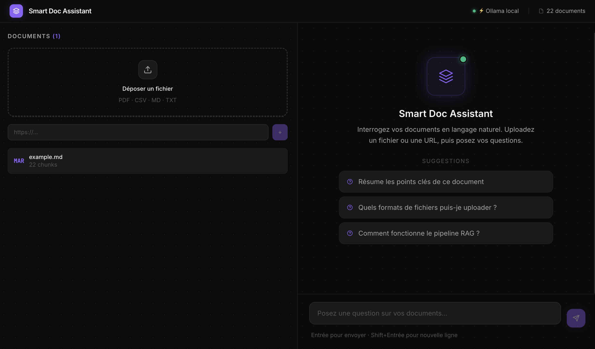
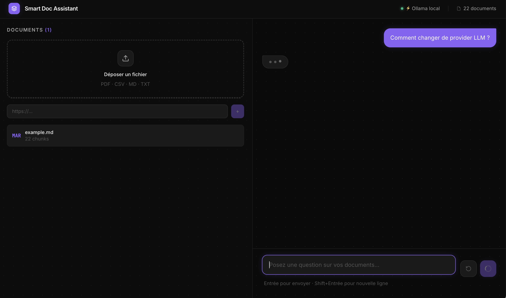
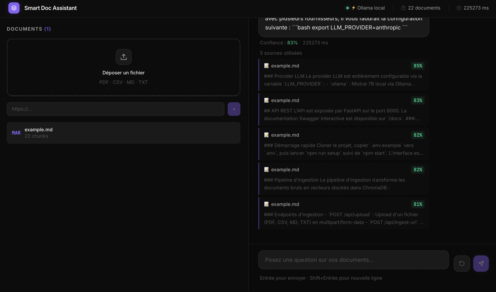

# Smart Doc Assistant


> **Agent RAG conversationnel** — Interrogez vos documents en langage naturel.
> Propulsé par **LangGraph · Mistral · ChromaDB · FastAPI · React 18**

---

## Aperçu

| Interface principale | Streaming en cours | Sources citées |
|---|---|---|
|  |  |  |

---

## Présentation

**Smart Doc Assistant** est un agent IA de type **RAG (Retrieval Augmented Generation)** qui permet d'interroger une base de documents hétérogènes en langage naturel, avec citation des sources.

L'architecture repose sur :
- **LangGraph** pour l'orchestration de l'agent (graph d'état)
- **LangChain** pour les loaders de documents et le pipeline RAG
- **ChromaDB** comme base vectorielle locale et persistante
- **Ollama + Mistral 7B** en local (gratuit, offline) ou **Mistral API** en production

---

## Fonctionnalités

| Fonctionnalité | Détail |
|---|---|
| **Ingestion multi-format** | PDF, CSV, Markdown, pages web (URL) |
| **Retrieval sémantique** | ChromaDB + nomic-embed-text, reranking par score |
| **Mémoire de conversation** | Contexte des 5 derniers échanges (LangGraph memory node) |
| **Sources citées** | Chaque réponse affiche les chunks utilisés + score de pertinence |
| **Multi-provider LLM** | Ollama (local) · Mistral API · Claude Haiku — switcher via `.env` |
| **Interface React** | Upload drag & drop + chat streaming token-by-token (SSE) + dark theme |
| **Streaming SSE** | Réponses en temps réel via Server-Sent Events (`/api/chat/stream`) |

---

## Architecture

```
┌─── React 18 + Vite + TailwindCSS ───────────────────────────┐
│  UploadPanel (drag&drop)        ChatWindow + SourceCards    │
└──────┬──────────────────────────────────┬───────────────────┘
       │ POST /api/upload                 │ POST /api/chat
       ▼                                  ▼
┌─── FastAPI + Uvicorn ───────────────────────────────────────┐
│                                                             │
│  Ingest Pipeline (LangChain)    LangGraph Agent             │
│  ├ PyMuPDF      (PDF)           ├ retrieve_node             │
│  ├ pandas       (CSV)           ├ rerank_node               │
│  ├ direct       (Markdown)      ├ memory_node (window=5)    │
│  └ httpx + BS4  (URL)           └ generate_node             │
│        ↓                                ↓                   │
│  RecursiveCharacterTextSplitter    Pydantic Settings        │
│  chunk=500 / overlap=50            config.py                │
│        ↓                                ↓                   │
│  ┌─────────────────────────────────────────────────────┐    │
│  │   ChromaDB  —  collection: smart_docs               │    │
│  │   nomic-embed-text (Ollama) — dim 768               │    │
│  └─────────────────────────────────────────────────────┘    │
│                         ↓                                   │
│  ┌─────────────────────────────────────────────────────┐    │
│  │   LLM (switchable via .env)                         │    │
│  │   ollama    → Mistral 7B (local, gratuit)           │    │
│  │   mistral   → Mistral API mistral-small-latest      │    │
│  │   anthropic → Claude Haiku                          │    │
│  └─────────────────────────────────────────────────────┘    │
└─────────────────────────────────────────────────────────────┘
```

---

## Démarrage rapide

### Prérequis

- [Python 3.11+](https://python.org)
- [Node.js 18+](https://nodejs.org)
- [Ollama](https://ollama.ai) — pour le mode local gratuit (voir installation ci-dessous)

### Installation d'Ollama

**macOS**
```bash
# Option 1 — Application native (recommandée)
# Télécharger le .dmg sur https://ollama.ai/download/mac puis l'installer

# Option 2 — Homebrew
brew install ollama
ollama serve   # lancer le serveur
```

**Linux** (Ubuntu, Debian, Fedora, Arch…)
```bash
curl -fsSL https://ollama.ai/install.sh | sh
ollama serve   # lancer le serveur (ou il tourne en service systemd)
```

**Windows**
```bash
# Télécharger l'installeur .exe sur https://ollama.ai/download/windows
# Ollama tourne ensuite en arrière-plan automatiquement
# WSL2 recommandé pour de meilleures performances GPU
```

**VPS / Serveur distant** (OVH, AWS, Hetzner…)
```bash
# Installation identique à Linux
curl -fsSL https://ollama.ai/install.sh | sh

# Lancer en service systemd (persistant après reboot)
sudo systemctl enable ollama
sudo systemctl start ollama

# Exposer Ollama sur le réseau (pour un backend sur un autre container)
OLLAMA_HOST=0.0.0.0 ollama serve

# Dans .env du projet, pointer vers le VPS :
# OLLAMA_BASE_URL=http://votre-ip:11434
```

Après installation, vérifier que tout est prêt :
```bash
npm run check   # vérifie Ollama + modèles mistral + nomic-embed-text
```

### Installation

```bash
git clone https://github.com/votre-username/smart-doc-assistant.git
cd smart-doc-assistant

# Installation complète automatique (venv Python + npm + modèles Ollama)
npm run setup
```

Le script `setup.sh` installe automatiquement :
- Le virtualenv Python + toutes les dépendances backend
- Les packages npm du frontend React
- Les modèles Ollama (`mistral` + `nomic-embed-text`) si absents

### Démarrage — mode développement

```bash
# Lance backend (FastAPI :8000) + frontend (React :5173) simultanément
npm start

# Arrêter les deux serveurs
npm stop
```

Ouvrir [http://localhost:5173](http://localhost:5173)

### Démarrage — mode Docker

```bash
# Build et lancement complet (interactif)
npm run docker:start

# Ou en arrière-plan
npm run docker:start:detach

# Première fois : télécharger les modèles Ollama
docker exec smart-doc-ollama ollama pull mistral
docker exec smart-doc-ollama ollama pull nomic-embed-text

# Arrêter
npm run docker:stop
```

Ouvrir [http://localhost](http://localhost) (port 80, Nginx sert le build React)

---

## Configuration LLM

Modifier `LLM_PROVIDER` dans `.env` :

```env
# Mode local gratuit (défaut)
LLM_PROVIDER=ollama
OLLAMA_MODEL=mistral

# Mistral API (production)
LLM_PROVIDER=mistral
MISTRAL_API_KEY=votre_clé_ici

# Claude Haiku (Anthropic)
LLM_PROVIDER=anthropic
ANTHROPIC_API_KEY=votre_clé_ici
```

---

## Scripts disponibles

### Démarrage / Arrêt

| Commande | Description |
|---|---|
| `npm run setup` | Installation complète (venv + npm + ollama pull + playwright) |
| `npm start` | Lance backend + frontend (concurrently, logs colorés) |
| `npm stop` | Arrête backend + frontend |
| `npm run start:backend` | Backend FastAPI seul (port 8000) |
| `npm run start:frontend` | Frontend React seul (port 5173) |
| `npm run stop:backend` | Arrête uniquement le backend |
| `npm run stop:frontend` | Arrête uniquement le frontend |
| `npm run check` | Vérifie Ollama + modèles présents |

### Docker

| Commande | Description |
|---|---|
| `npm run docker:start` | Build + lance (interactif, Ctrl+C pour arrêter) |
| `npm run docker:start:detach` | Build + lance en arrière-plan |
| `npm run docker:stop` | Arrête les conteneurs |
| `npm run docker:clean` | Arrête + supprime les images |
| `npm run docker:logs` | Voir les logs en direct |
| `npm run docker:ps` | État des conteneurs |

### Tests

| Commande | Description |
|---|---|
| `npm run test:unit` | Tests unitaires Python (pytest) |
| `npm run test:integration` | Tests d'intégration Python |
| `npm run test:all` | Tous les tests Python + couverture HTML |
| `npm run test:coverage` | Rapport de couverture (terminal) |
| `npm run test:frontend` | Tests unitaires React (Vitest, 82 tests) |
| `npm run test:frontend:coverage` | Couverture frontend |
| `npm run test:e2e` | Tests E2E Playwright (nécessite serveurs démarrés) |
| `npm run test:ingest` | Teste le pipeline d'ingestion |
| `npm run test:retrieval` | Teste le retrieval sémantique |
| `npm run test:agent` | Session CLI interactive avec l'agent |

### Gestion d'Ollama

```bash
ollama serve          # Démarrer le serveur Ollama (port 11434)
ollama list           # Lister les modèles téléchargés
ollama ps             # Voir les modèles actifs en mémoire
pkill ollama          # Arrêter le serveur Ollama
```

---

## API Reference

Documentation interactive disponible sur [http://localhost:8000/docs](http://localhost:8000/docs) (Swagger auto-généré par FastAPI).

### `POST /api/chat`

```json
// Request
{ "question": "Quelle est la limite de taux de l'API ?", "session_id": "abc123" }

// Response
{
  "answer": "D'après la documentation v2.3, la limite est de 100 req/min.",
  "sources": [
    { "content": "...", "source": "api-doc.pdf", "page": 12, "score": 0.87 }
  ],
  "confidence": 0.87,
  "latency_ms": 1240
}
```

Voir [`docs/API.md`](docs/API.md) pour la référence complète.

---

## Stack complète

| Couche | Technologie | Rôle |
|---|---|---|
| Orchestration agent | **LangGraph 0.2** | Graph d'état, nodes, edges conditionnels |
| Framework LLM | **LangChain 0.3** | Loaders, splitters, chains |
| LLM local | **Ollama + Mistral 7B** | Inférence locale gratuite |
| LLM prod | **Mistral API** | `mistral-small-latest` |
| Embeddings | **nomic-embed-text** | Via Ollama, open-source |
| Base vectorielle | **ChromaDB** | Persistance locale |
| Historique | **SQLite** | Conversations persistantes (stdlib Python) |
| Backend | **FastAPI + Uvicorn** | REST API async |
| Frontend | **React 18 + Vite** | Interface SPA |
| CSS | **TailwindCSS 3** | Utility-first styling |
| Tests frontend | **Vitest + RTL** | 109 tests unitaires composants/hooks |
| Conteneurisation | **Docker Compose** | 3 services : backend + frontend + ollama |
| PDF | **PyMuPDF** | Parsing texte + métadonnées |
| Web scraping | **httpx + BeautifulSoup4** | Ingestion URLs |
| Config | **Pydantic Settings v2** | `.env` typé et validé |

---

## Tester l'application

Un document de démonstration est inclus dans `data/sample_docs/example.md`. Il contient la documentation complète du projet (architecture, configuration, API, tests).

### 1. Uploader le document

Dans l'interface, ouvrir le panneau **DOCUMENTS** et déposer `data/sample_docs/example.md` (ou cliquer pour sélectionner le fichier).

Le pipeline s'exécute automatiquement : chargement → découpage en chunks → embeddings `nomic-embed-text` → stockage ChromaDB.

### 2. Questions à poser

| Question | Ce que ça teste |
|---|---|
| `Quels sont les nœuds du graph LangGraph ?` | Retrieval sur l'architecture agent |
| `Quelle est la taille des chunks et l'overlap ?` | Retrieval sur la configuration |
| `Comment changer de provider LLM ?` | Retrieval sur la config `.env` |
| `Quels formats de fichiers sont supportés ?` | Retrieval sur les fonctionnalités |
| `Quelle est la limite de taille d'un fichier uploadé ?` | Retrieval sur les contraintes |
| `Comment fonctionne la mémoire de conversation ?` | Retrieval sur la fenêtre glissante |
| `Quels endpoints sont disponibles pour l'historique ?` | Retrieval sur l'API REST |

### 3. Ce qu'on vérifie

- **Score de confiance** affiché sous la réponse : > 60% = bon retrieval
- **Sources citées** : le chunk utilisé doit correspondre à la question
- **Latence** : dépend du LLM configuré (Ollama local = 10-60s CPU, Mistral API = < 1s)

---

## Documentation

- [`docs/TUTORIAL.md`](docs/TUTORIAL.md) — Code commenté brique par brique (ingest, agent, streaming, hooks React)
- [`docs/TECHNOLOGIES.md`](docs/TECHNOLOGIES.md) — Chaque technologie expliquée avec alternatives
- [`docs/ARCHITECTURE.md`](docs/ARCHITECTURE.md) — Architecture détaillée avec schéma
- [`docs/SPECS.md`](docs/SPECS.md) — Spécifications fonctionnelles et techniques
- [`docs/API.md`](docs/API.md) — Référence API complète
- [`docs/OLLAMA.md`](docs/OLLAMA.md) — Guide Ollama : modèles, tests CLI, VPS, confidentialité

---

## Troubleshooting

| Problème | Cause probable | Solution |
|---|---|---|
| `❌ Ollama n'est pas installé` | Ollama absent | Voir section [Installation d'Ollama](#installation-dollama) |
| `❌ Le serveur Ollama ne répond pas` | Ollama non démarré | Lancer `ollama serve` dans un terminal |
| `ModuleNotFoundError: No module named 'backend'` | Mauvais répertoire de lancement | Le script `start-backend.sh` lance depuis la racine — vérifier `npm run start` |
| `chromadb` bloqué à l'install | Python 3.14 + `onnxruntime` absent | Le `setup.sh` gère ça automatiquement via `--no-deps` |
| L'interface ne répond pas | Backend non démarré | Vérifier `curl http://localhost:8000/api/health` |
| Modèle lent / timeout | CPU seul, pas de GPU | Normal sur CPU — Mistral 7B prend 10-30s/réponse sans GPU |
| VPS — Ollama inaccessible | Firewall ou mauvais host | Lancer avec `OLLAMA_HOST=0.0.0.0 ollama serve` et ouvrir le port 11434 |

---

## Licence

© 2026 Alexis MASSOL — Tous droits réservés.

Ce projet est un **portfolio de démonstration**. Vous pouvez le consulter, le forker et l'étudier à des fins personnelles et éducatives. Toute utilisation commerciale ou redistribution est interdite sans autorisation écrite. Voir [LICENSE](LICENSE) pour les conditions complètes.

---

*Projet portfolio — Alexis MASSOL | Senior Software Engineer · Embedded Systems & Cloud Platforms*
*Stack : LangGraph · LangChain · Mistral · ChromaDB · FastAPI · React 18*
